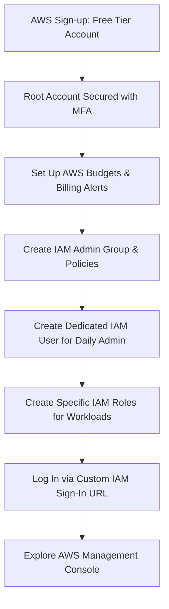
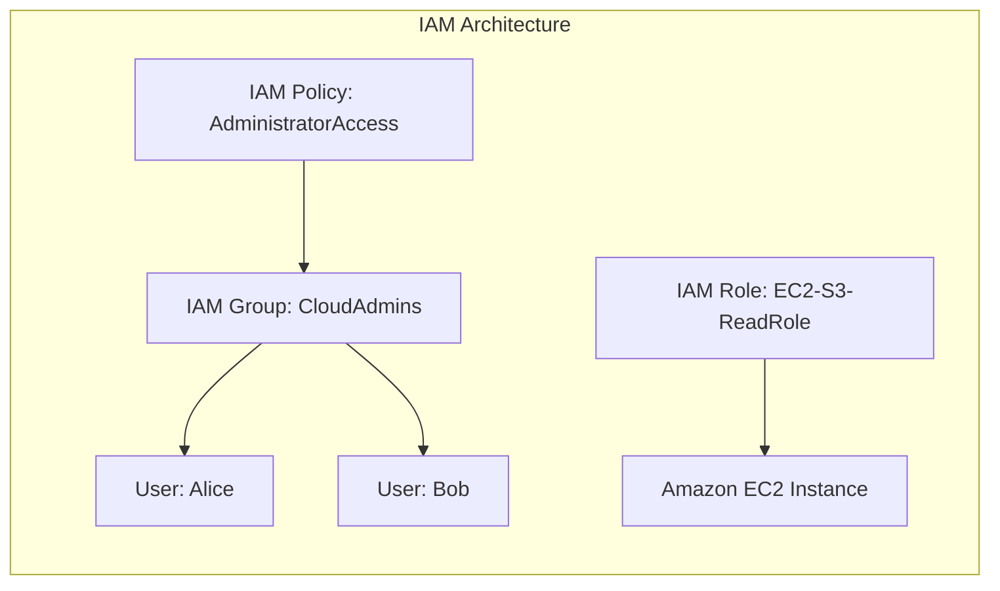
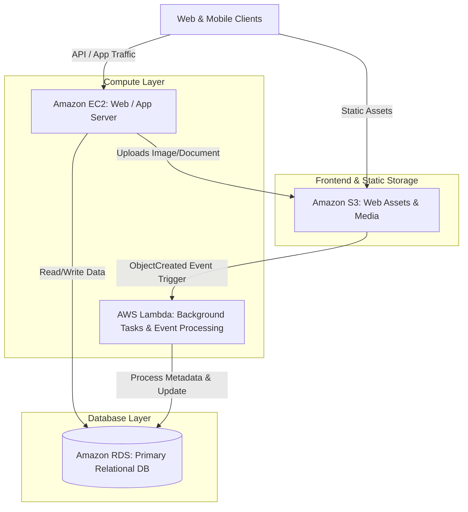

# AWS Cloud Foundations: Comprehensive Assignment Report

**Author:** Sakshi Bhalekar  
**Date:** September 15, 2026  
**Subject:** Cloud Computing & AWS Infrastructure  
**Status:** Completed Submission  

---

## Executive Summary

Cloud computing has transformed modern computing infrastructure by offering on-demand delivery of compute power, database storage, applications, and other IT resources via the internet with pay-as-you-go pricing. Amazon Web Services (AWS) is the world's most comprehensive and broadly adopted cloud platform.

This report fulfills the two-part assignment:
1. **Assignment 1 — Create and Configure AWS Account:** Comprehensive setup guide covering the AWS Free Tier, identity and security governance using AWS Identity and Access Management (IAM), and navigation of the AWS Management Console.
2. **Assignment 2 — Explore Core AWS Services:** Technical deep-dive and functional summary report analyzing four foundational AWS services: **Amazon EC2**, **Amazon S3**, **Amazon RDS**, and **AWS Lambda**, concluding with an integrated reference architecture demonstrating how they operate collectively.

---

# Part 1: Create and Configure AWS Account



---

### 1.1 Setting Up an AWS Free Tier Account

The **AWS Free Tier** allows users to gain hands-on experience with AWS services at no cost up to specific usage limits. It includes three distinct types of offers:
- **Always Free:** Resources that do not expire at the end of the 12-month free tier period (e.g., AWS Lambda: 1 million free requests/month; Amazon DynamoDB: 25 GB of free storage).
- **12-Months Free:** Available to new AWS customers for 12 months following initial registration (e.g., Amazon EC2: 750 hours/month of `t2.micro` or `t3.micro`; Amazon S3: 5 GB standard storage; Amazon RDS: 750 hours/month of `db.t2.micro` or `db.t3.micro`).
- **Short-Term Trials:** Free trials starting from date of activation (e.g., Amazon SageMaker, Amazon Redshift).

#### Step-by-Step Registration Procedure

1. **Visit the AWS Portal:**
   - Navigate to [aws.amazon.com/free](https://aws.amazon.com/free) and click **Create an AWS Account**.
2. **Provide Account Credentials:**
   - **Root User Email Address:** Enter a secure, monitored email address (this becomes the root identity).
   - **AWS Account Name:** Choose a recognizable descriptive name.
   - Click **Verify email address** and submit the one-time verification code sent to your inbox.
3. **Set Root Password:**
   - Define a strong master password (minimum 8 characters, combining uppercase, lowercase, numbers, and symbols).
4. **Contact Information:**
   - Select **Personal** (for learning and individual projects) or **Business**.
   - Fill in full name, phone number, country/region, and postal address.
   - Accept the AWS Customer Agreement.
5. **Payment Method Verification:**
   - Enter a valid credit or debit card.
   - *Note:* AWS processes an authorization hold (typically $1 USD or local equivalent) to verify identity; it is refunded automatically within 3–5 business days.
6. **Identity Confirmation:**
   - Choose verification via SMS or voice call.
   - Enter your phone number, receive the 4-digit code, and enter it into the console.
7. **Support Plan Selection:**
   - Select **Basic Support - Free** (includes 24/7 access to customer service, documentation, whitepapers, and AWS Trusted Advisor basic checks).
8. **Finalize Setup:**
   - Click **Complete sign up** and wait a few minutes for the account activation confirmation email.

---

### 1.2 Proactive Cost Protection: Setting Up Billing Alarms

Before launching any resources, industry best practice mandates setting up billing guardrails to avoid accidental out-of-tier charges.

> [!IMPORTANT]
> Always enable billing alerts immediately after creating a new AWS account.

1. In the console search bar, search for **Billing and Cost Management**.
2. In the left navigation menu, choose **Billing Preferences**.
3. Check the options:
   - **Receive PDF Invoice by Email**
   - **Receive Free Tier Usage Alerts** (alerts you when approaching 85% of free tier limits)
   - **Receive Billing Alerts**
4. Navigate to **AWS Budgets**:
   - Click **Create budget**.
   - Choose **Zero spend budget** (notifies you as soon as spending exceeds $0.01) or **Monthly cost budget** with a small limit (e.g., $5.00).
   - Enter your notification email address and confirm budget creation.

---

### 1.3 Identity & Access Management (IAM): Users, Groups, and Roles

**AWS Identity and Access Management (IAM)** is a web service that controls access to AWS resources. It provides centralized management of users, security credentials (passwords, access keys), and fine-grained permissions.

#### The Golden Security Rule: Root vs. IAM
- **Root User:** Created when the account is opened. Has complete, unrestricted access to every resource and billing setting. **Never use the root user for daily administrative or development work.**
- **IAM User:** An identity created within your AWS account with specific credentials and explicit permissions tailored to a specific human or system.



#### Step 1: Secure the Root User with MFA (Multi-Factor Authentication)
1. Sign in to the AWS Management Console as the **Root user**.
2. On the top-right user menu, click your account name and select **Security credentials**.
3. Under **Multi-factor authentication (MFA)**, click **Assign MFA**.
4. Specify a device name (e.g., `RootUser-Authenticator`).
5. Choose **Authenticator app** (e.g., Google Authenticator, Microsoft Authenticator, or Authy).
6. Click **Next**, reveal the QR code, scan it using the authenticator app on your mobile device, and enter two consecutive 6-digit codes.
7. Click **Add MFA**. Your root account is now protected by hardware/software 2FA.

#### Step 2: Create an IAM User Group
1. In the AWS search bar, type **IAM** and select it.
2. In the navigation pane, click **User groups** > **Create group**.
3. Group name: `CloudAdmins`.
4. Under **Attach permissions policies**, search for and select `AdministratorAccess` (provides full access to AWS services, but can be restricted if desired).
5. Click **Create group**.

#### Step 3: Create an IAM User
1. In the IAM navigation pane, click **Users** > **Create user**.
2. User details:
   - User name: `admin-engineer`.
   - Select **Provide user access to the AWS Management Console**.
   - Choose **I want to create an IAM-user**.
   - Select **Custom password** or **Autogenerated password**.
   - Enable **Users must create a new password at next sign-in (recommended)**.
3. Under **Set permissions**, select **Add user to group** and check `CloudAdmins`.
4. Add tags if required (e.g., `Department: DevOps`).
5. Review configuration and click **Create user**.
6. **Crucial:** Download the `.csv` file containing the console sign-in URL, user name, and initial password. Save this securely.

#### Step 4: Understanding and Creating IAM Roles
An **IAM Role** is an IAM identity that you can create in your account that has specific permissions, but is **not** associated with a specific person. Instead, it is assumed by:
- AWS Services (e.g., an EC2 instance reading data from S3 without hardcoding API keys in code).
- External identities (Federation/SAML/OAuth).
- Cross-account access.

**Hands-on Example — Creating an EC2-to-S3 Read-Only Role:**
1. In IAM, click **Roles** > **Create role**.
2. **Trusted entity type:** Choose **AWS service**.
3. **Use case:** Choose **EC2**, then click **Next**.
4. **Permissions:** Search for and select `AmazonS3ReadOnlyAccess`.
5. **Role name:** Enter `EC2-ReadOnly-S3-Role`.
6. Click **Create role**.
*(This role can now be attached directly to an EC2 instance profile, ensuring secure, credential-less SDK access to S3).*

---

### 1.4 Exploring the AWS Management Console

The **AWS Management Console** is a web-based graphical interface that provides access to AWS services and account configuration.

```
┌─────────────────────────────────────────────────────────────────────────────┐
│ AWS Console Top Navigation Bar                                              │
│ [AWS Logo] [Services ▾] [ Search (Alt+S)                     ] [Region: us-east-1 ▾] [User: admin ▾] │
├─────────────────────────────────────────────────────────────────────────────┤
│ Console Home Widgets                                                        │
│ ┌────────────────────────┐ ┌────────────────────────┐ ┌───────────────────┐ │
│ │ Recently visited       │ │ AWS Health             │ │ Cost and usage    │ │
│ │ • EC2   • S3           │ │ Service health status  │ │ Forecast & Budget │ │
│ │ • RDS   • Lambda       │ │ All systems normal     │ │ $0.00 / Free Tier │ │
│ └────────────────────────┘ └────────────────────────┘ └───────────────────┘ │
└─────────────────────────────────────────────────────────────────────────────┘
```

#### Key Elements of the Management Console

1. **Unified Global Search Bar (`Alt + S`):**
   - Allows instant discovery of services (e.g., "EC2", "VPC"), features, documentation, marketplace solutions, and AWS Knowledge Center tutorials.
2. **AWS Regions and Availability Zones (AZs):**
   - Located in the top right header (e.g., *US East (N. Virginia) `us-east-1`*, *US West (Oregon) `us-west-2`*, *Europe (Frankfurt) `eu-central-1`*).
   - **Region:** A distinct physical geographic location with multiple isolated data centers.
   - **Availability Zone (AZ):** One or more discrete data centers with redundant power, networking, and connectivity within a Region.
   - *Best Practice:* Select a region closest to your end users to minimize latency, satisfy data sovereignty requirements, and optimize cost.
3. **Console Home Dashboard & Widgets:**
   - Fully customizable workspace featuring draggable widgets: *Recently visited*, *AWS Health*, *Cost and usage*, *CloudWatch alarms*, and *Favorites bar*.
4. **AWS CloudShell:**
   - Accessible via the terminal icon `[>_]` in the top navigation bar.
   - Provides a pre-authenticated, browser-based Linux shell equipped with the AWS CLI, Python, Node.js, and 1 GB of persistent `/home` storage at no extra charge.

---

# Part 2: Explore Core AWS Services (Summary Report)

AWS offers over 200 fully featured services. Among these, four foundational pillars anchor virtually all cloud computing solutions:
1. **Compute:** Amazon EC2
2. **Storage:** Amazon S3
3. **Database:** Amazon RDS
4. **Serverless Compute:** AWS Lambda



---

## 2.1 Amazon EC2 (Elastic Compute Cloud)

### Overview & Core Purpose
**Amazon EC2** is a central component of AWS’s Infrastructure as a Service (IaaS) offering. It provides resizable, on-demand compute capacity in the cloud, allowing organizations to run virtual machine instances with complete administrative and OS-level control.

### Key Architectural Concepts
- **Amazon Machine Image (AMI):** A pre-configured template that packages the operating system (Linux, Windows), application server, and software packages required to launch an instance.
- **Instance Types:** Optimized for varying workload characteristics:
  - *General Purpose (e.g., `t4g`, `t3`, `m6i`):* Balanced compute, memory, and networking.
  - *Compute Optimized (e.g., `c6i`, `c7g`):* High-performance processors for batch processing, media transcoding, and scientific modeling.
  - *Memory Optimized (e.g., `r6i`, `x2gd`):* Designed for in-memory caches, big data analytics, and real-time processing.
  - *Storage Optimized (e.g., `i3en`, `d3`):* High, sequential read/write access for data warehousing.
- **Storage Options:**
  - *Amazon EBS (Elastic Block Store):* Persistent, high-performance block-level storage volumes attached over network.
  - *Instance Store:* Ephemeral, physically attached high-speed SSD storage (data lost on instance stop).
- **Security Groups:** Stateful virtual firewalls controlling inbound and outbound network traffic at the instance level.

### Purchasing Options
1. **On-Demand:** Pay for compute capacity by the second or hour with no long-term commitment.
2. **Savings Plans & Reserved Instances (RIs):** Up to 72% discount in exchange for committing to a consistent amount of usage over a 1 or 3-year term.
3. **Spot Instances:** Bid on spare AWS compute capacity with discounts up to 90% off On-Demand rates; suitable for fault-tolerant, interruptible workloads.

### Primary Use Cases
- Hosting traditional multi-tier enterprise web applications.
- Legacy software migration (lift-and-shift workloads).
- High-Performance Computing (HPC) and distributed big data processing clusters.
- Development and staging environments requiring bespoke operating system configurations.

---

## 2.2 Amazon S3 (Simple Storage Service)

### Overview & Core Purpose
**Amazon S3** is an industry-leading object storage service designed to store and retrieve any amount of data from anywhere on the web. It delivers industry-standard durability of **99.999999999% (11 9s)** by redundantly storing objects across multiple physical availability zones.

### Key Architectural Concepts
- **Buckets:** Logical containers for storing data. Bucket names are globally unique across all AWS accounts worldwide.
- **Objects:** The fundamental entity stored in S3, consisting of:
  - *Key:* The unique name assigned to the object (acting as a hierarchical path, e.g., `photos/2026/vacation.jpg`).
  - *Value:* The raw binary data (file size ranging from 0 bytes up to 5 TB).
  - *Metadata:* Key-value pairs describing the object (Content-Type, creation date, custom attributes).
  - *Version ID:* Enabled when bucket versioning is activated to safeguard against accidental deletions or overwrites.
- **Storage Classes:**
  - **S3 Standard:** Low latency, high throughput for frequently accessed data.
  - **S3 Intelligent-Tiering:** Automatically moves data between tiers (Frequent, Infrequent, Archive) to optimize costs without performance impact.
  - **S3 Standard-Infrequent Access (IA):** Lower storage cost, small per-GB retrieval fee.
  - **S3 Glacier Flexible / Deep Archive:** Ultra-low-cost archival storage for compliance, with retrieval times ranging from minutes to 12 hours.
- **Security & Access Controls:** S3 Block Public Access (default), Bucket Policies (JSON-based resource policies), Access Control Lists (ACLs), and SSE-S3/SSE-KMS encryption.

### Primary Use Cases
- Backup, disaster recovery, and long-term compliance data archiving.
- Data lakes for machine learning, artificial intelligence, and big data query tools (e.g., AWS Athena, EMR).
- Static website hosting (HTML, CSS, JavaScript, client-side single-page applications).
- Cloud-native media asset storage, streaming, and content delivery (paired with Amazon CloudFront).

---

## 2.3 Amazon RDS (Relational Database Service)

### Overview & Core Purpose
**Amazon RDS** is a managed relational database service (Platform as a Service - PaaS) that simplifies the setup, operation, and scaling of relational databases in the cloud. It automates time-consuming administrative tasks such as hardware provisioning, database setup, patching, and backups.

### Supported Database Engines
1. **Amazon Aurora** (AWS-engineered MySQL and PostgreSQL compatible cloud-native database; offers up to 5x throughput of standard MySQL).
2. **PostgreSQL**
3. **MySQL**
4. **MariaDB**
5. **Oracle Database**
6. **Microsoft SQL Server**

### Key Managed Capabilities
- **Automated Backups & Point-in-Time Recovery (PITR):** Automatically captures continuous daily storage volume snapshots and transaction logs, allowing restoration to any second within a 1-to-35 day retention window.
- **Multi-AZ Deployments (High Availability):** Automatically provisions and maintains a synchronous standby replica in a different Availability Zone. In the event of planned maintenance or unplanned hardware failure, RDS executes an automatic failover without manual administrative intervention.
- **Read Replicas (Scalability):** Asynchronous read-only replicas across the same or different regions, offloading read-heavy workloads from the primary master database.
- **Automated Security Patching:** Ensures database engine versions remain secure and updated during scheduled maintenance windows.

### Primary Use Cases
- Transactional relational enterprise applications (E-commerce shopping carts, order fulfillment).
- ERP (Enterprise Resource Planning) and CRM (Customer Relationship Management) backends.
- Online Transaction Processing (OLTP) systems requiring strict ACID compliance.
- Replacing on-premises commercial databases (e.g., Oracle or SQL Server) to cut licensing overhead.

---

## 2.4 AWS Lambda

### Overview & Core Purpose
**AWS Lambda** is an event-driven, serverless compute service (Function as a Service - FaaS). It enables developers to run code without provisioning, managing, or scaling servers. You upload your code as a function, and Lambda handles all compute resource allocation, operating system maintenance, high availability, and scaling.

### Key Architectural Concepts
- **Event-Driven Execution:** Functions execute in response to triggers from over 200 AWS services or direct HTTP calls. Common triggers include:
  - *Amazon S3:* New object uploaded or deleted.
  - *Amazon DynamoDB:* Table item modifications (Streams).
  - *Amazon API Gateway:* Inbound RESTful or WebSocket HTTP requests.
  - *Amazon EventBridge / CloudWatch:* Scheduled cron jobs or system state transitions.
  - *Amazon SQS / SNS:* Decoupled messaging queues and topics.
- **Supported Runtimes:** Native support for Python, Node.js, Java, C#, Go, Ruby, and custom runtimes (including container images conforming to the Open Container Initiative).
- **Execution Limits:**
  - Maximum execution duration: **15 minutes** per invocation.
  - Configurable memory allocation: **128 MB to 10,240 MB (10 GB)** (CPU power scales proportionally with assigned memory).
  - Ephemeral disk storage (`/tmp`): **512 MB to 10,240 MB**.
- **Pricing Model:** Pure pay-per-use billing based on the number of requests and duration of execution measured in milliseconds (GB-seconds). Zero idle cost when no functions are running.

### Primary Use Cases
- Serverless web backends and microservices (paired with Amazon API Gateway).
- Real-time file and data transformation (e.g., automatic image resizing or PDF generation when a file hits an S3 bucket).
- Real-time stream processing and IoT sensor telemetry ingestion (paired with Amazon Kinesis).
- Automated cloud operations and scheduled maintenance tasks (e.g., stopping non-production EC2 instances after business hours).

---

# Part 3: Comparative Analysis & Architectural Synergy

### 3.1 Service Comparison Matrix

| Attribute | Amazon EC2 | Amazon S3 | Amazon RDS | AWS Lambda |
| :--- | :--- | :--- | :--- | :--- |
| **Cloud Model** | IaaS (Infrastructure as a Service) | Storage as a Service (Object) | PaaS (Platform as a Service) | FaaS / Serverless |
| **Primary Unit** | Virtual Server (Instance) | Object (Bucket / File) | Database Instance (Engine) | Function (Code snippet) |
| **Maintenance Burden** | Customer manages OS, patches & apps | Fully managed by AWS | Customer manages DB schema; AWS manages host & OS | Zero infrastructure management |
| **Scaling Model** | Manual or via Auto Scaling Groups | Unlimited automated elasticity | Vertical scaling or Read Replicas | Instant, automatic horizontal scaling per event |
| **Execution Duration** | Persistent (Runs 24/7 until stopped) | Persistent storage | Persistent (24/7 running engine) | Ephemeral (Max 15 minutes per run) |
| **Primary Billing Factor**| Instance type per second/hour | Storage volume (GB/month) + transfer | DB instance class per hour + storage | Invocations + Compute Duration (ms) |

---

### 3.2 Real-World Integrated Solution: Cloud-Native Image Management Platform

To understand how these services interlock, consider a modern web application:
1. **Frontend & User Uploads:** Users visit a web application whose static files (HTML/JS) are hosted on **Amazon S3** and delivered via Amazon CloudFront.
2. **Application Core:** Authenticated user requests and application business logic run on **Amazon EC2** instances inside an Auto Scaling Group behind an Application Load Balancer (ALB).
3. **Relational Data Management:** User accounts, orders, permissions, and payment transactions are stored with ACID guarantees on a **Multi-AZ Amazon RDS** instance.
4. **Asynchronous Serverless Processing:** When a user uploads a high-resolution profile photo to an **S3 bucket**, the `s3:ObjectCreated` event automatically invokes an **AWS Lambda** function.
5. Lambda extracts image metadata, compresses the image into thumbnails, saves the optimized versions back into S3, and writes the resulting URLs to the database in **Amazon RDS**.

This architectural synergy leverages each service for its optimal purpose:
- EC2 provides persistent processing power for long-running web sessions.
- S3 delivers virtually infinite, durable, low-cost asset storage.
- RDS guarantees relational consistency and high availability for transactional data.
- Lambda eliminates idle server cost for sporadic, asynchronous background processing tasks.

---

# Part 4: Key Recommendations & Best Practices Checklist

1. **Security & Identity:**
   - [x] Protect Root account with hardware or software MFA immediately.
   - [x] Adopt the Principle of Least Privilege (PoLP) when granting IAM permissions.
   - [x] Attach IAM Roles to EC2 instances and Lambda functions instead of embedding secret AWS Access Keys.
2. **Cost Management:**
   - [x] Create an AWS Budget with email threshold alerts within your first hour.
   - [x] Regularly check the AWS Cost Explorer and Billing Dashboard.
   - [x] Stop or terminate unused EC2 instances and delete unattached EBS volumes.
3. **Architectural Reliability:**
   - [x] Employ Multi-AZ configurations for critical relational databases in Amazon RDS.
   - [x] Enable S3 bucket versioning and lifecycle policies for sensitive data retention.
   - [x] Decouple workloads using serverless Lambda functions to prevent single-point-of-failure bottlenecks.

---
*Report compiled and submitted for Cloud Computing Academic Assignment requirements.*
